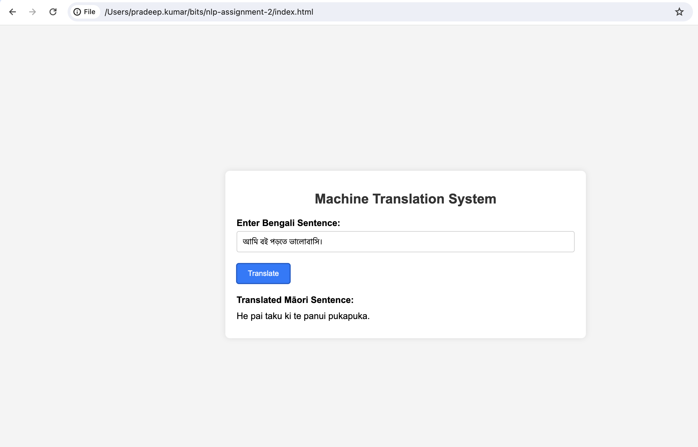

# Bengali to Māori Machine Translation System

This project aims to develop a sophisticated machine translation system that can translate short sentences between Bengali and te reo Māori (Māori in New Zealand).

## Table of Contents

- [Installation](#installation)
- [Usage](#usage)
- [Features](#features)
- [Contributing](#contributing)
- [License](#license)

## Installation

To install and set up the project, follow these instructions:

1. Install Python3
2. Install the required dependencies: `pip install -r requirements.txt`

## Usage

To use the translation system, follow these steps:

1. Run the Unicorn Web Server: `uvicorn main:app --host 0.0.0.0 --port 8000 --reload`
2. Access the index.html file on web browser.
3. Use the web interface for translation.

Example usage:

